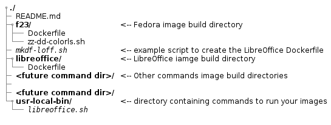

***(Work in progress)***
# Set-up your environment
Summary:
- [Install Docker](#install-docker)
- [Convenient Docker](#convenient-docker) command access
- [Target directory tree](#target-directory-tree)
- [Build your own](#build-your-own) Fedora Docker image
- [The application image](#the-application-image)
- [Run your dockerized application(s)](#run-your-dockerized-applications)

## Install Docker - unless already done
Use **dnf** (Fedora) or **yum** (RHEL, CentOS), as appropriate:  
   ```
   [<username>@<hostname> ~]$ sudo dnf install docker docker-selinux
   [<username>@<hostname> ~]$ sudo systemctl enable docker
   [<username>@<hostname> ~]$ sudo systemctl start docker
   ```
Depending on your ***sudo*** settings, you may be asked for ***your*** password for each of these *sudo* commands.

## Convenient Docker access
In order to be able to run all the docker commands as described here, please (if you did not do so, already):
 * create a `docker` group
 * add yourself to that group - assuming "you" are `<username>` 

    ```
    [<username>@<hostname> ~]$ sudo -i
    ```
_(again, depending on your ***sudo*** settings, you may be asked for ***your*** password...)_
    ```
    [root@<hostname> ~]# groupadd docker
    [root@<hostname> ~]# gpasswd -a <username> docker
    [root@<hostname> ~]# systemctl restart docker
    ```
    
Now, **log out** and **log back in !** (you need to "pick-up" the group membership in the current log-in session).  
If running in one of the incarnations of "The X terminal" (MATE, GNOME) it **may** be enough to close it (**Ctrl-D**) and open a new one.  

You should, now, be able to "talk" to the Docker daemon _"as yourself"_. Try (at least) this:

   ```
   [<username>@<hostname> ~]$ docker info
   ```
## Target directory tree
Just to give you an idea of the (possible) directory & file hierarchy which we are working towards:  



In case you cloned this project locally (`git clone https://github.com/dumdan/dockws.git`) in your home directory you'd have the whole tree there, already.

## Build your own - ***local*** - Fedora Docker image
   ```
   [<username>@<hostname> ~]$ cd dockws/environment/f23
   [<username>@<hostname> f23]$ vim Dockerfile
   ```
Of course, for RHEL and CentOS, **dnf** should be substituted by **yum**, in the `Dockerfile`, below.  
_---- [Dockerfile](f23/Dockerfile) contents, in the **f23** directory ----_  
(It would be good to change _"Your Name"_ and _"your email address"_ with **your** actual values)
   ```
   FROM fedora
   MAINTAINER Your Name <your email address>
   RUN dnf install -y procps iputils && \
   	dnf -y update \
   	dnf clean all
   # You may, safely, ignore (comment-out) the next
   # COPY command. It reflects my VERY opinionated view
   # on how time should be displayed by the "ls" command:
   COPY zz-dd-colorls.sh /etc/profile.d/
   
   CMD ["sleep", "infinity"]
   ```
Now, for the **actual build** (you're still, in the "f23" directory):
```
   [<username>@<hostname> f23]$ docker build -t <username>/f23 .
```
***Please, note*** the **dot** at the end of that command. It _is_ important !  
(You do not, really, have to prefix the image with your **\<username\>**, but you **should** do something of that kind - please, see the docs for details)

The build is going to take a while since it may download and install quite a few __rpm__ packages.  
When finished, you should be able to see the new image in the local Docker cache:
```
[<username>@<hostname> f23]$ docker images
REPOSITORY                  TAG                 IMAGE ID            CREATED             VIRTUAL SIZE
<username>/f23              latest              3129cde806e2        6 hours ago         352 MB
<none>                      <none>              62e7ea3bf76c        9 days ago          352.3 MB
docker.io/fedora            latest              597717fc21bd        7 weeks ago         204 MB
[<username>@<hostname> f23]$ 
```
The actual listing will look a little different... but you get the idea.  
Here's what it was in ***my case:***
```
[daniel@oryxdd ~]$ docker images
REPOSITORY                TAG                 IMAGE ID            CREATED             VIRTUAL SIZE
daniel/f23                latest              3129cde806e2        23 hours ago        352 MB
<none>                    <none>              62e7ea3bf76c        9 days ago          352.3 MB
docker.io/fedora          latest              597717fc21bd        7 weeks ago         204 MB
[daniel@oryxdd ~]$ 
```

# The application image
And, of course, I had to choose a pretty _"heavy"_ application... ***Libre Office !***  
(#sarcasm)

To build the image, go up to the parent directory
```
	[<username>@<hostname> f23]$ cd ../
	[<username>@<hostname> environment]$ 
```
and **customize** (fill-in your specific details) the script [**`mkdf-loff.sh`**](./mkdf-loff.sh).
Then, run it:
```
	[<username>@<hostname> environment]$ ./mkdf-loff.sh
```
This will result in the generation of the file [**f23/Dockerfile**](f23/Dockerfile).

Finally, **let's build that Docker image:**
```
	[<username>@<hostname> environment]$ docker build -t <username>/f23_libreoffice:5042 libreoffice
```

**Note** the build command looks a little different, this time:
- the "build directory" is mentioned explicitly (`libreoffice`)
- the image name has the complete form:  
```
    <repo-name>/<image-name>:<tag>
```  
    (it so happens that the Libre Office version was "5.0.42" when I did this !)

## Run your dockerized application(s)
For this context - running desktop  applications - there shouldn't be many security concerns. In most cases, the desktop user is, also, (one of) the administrators of the machine.

Running the applications (the corresponding Docker containers) depends _a lot_ on the nature of the applications.
For the particular case of Libre Office, __I chose__ to restrict it's network access completely. This further aleviates most security concerns.  
Keep in mind, nonetheless, that the container **does** share the `X11 connection` and such a setup is, by default, vulnerable to potential container break-out.

Back to business... we were at the _running the application_ stage.  
Assuming you are, still, in the **`environment`** directory, you may try runing the container by executing the script [**`libreoffice.sh`**](./usr-local-bin/libreoffice.sh):

```
   [<username>@<hostname> environment]$ usr-local-bin/libreoffice.sh
```
which is just a simple wrapper for the command:

``` 
    docker run  --rm \
      --memory="1g" \
      -v /tmp/.X11-unix:/tmp/.X11-unix \
      -v /etc/machine-id:/etc/machine-id:ro \
      -v /home/daniel:/home/daniel:z \
      -e DISPLAY=unix$DISPLAY \
      -h "$(hostname -s)" \
      --net "none" \
      --name libreoffice \
      <username>/f23_libreoffice:5042 $@ &
```
   
The result **should be**... Libre Office runing !  
(and a few error messages related to the inability to "talk" to the desktop manager)

As you can see, I restricted the memory this container may use to 1G and named the running instance **`libreoffice`**.

You may also, at this stage, see the container running with **`docker ps`**. In my case, this is the result:
```
[daniel@oryxdd ~]$ docker ps
CONTAINER ID        IMAGE                         COMMAND                  CREATED              STATUS              PORTS               NAMES
a9f86a372bf5        daniel/f23_libreoffice:5042   "/usr/bin/libreoffice"   About a minute ago   Up About a minute                       libreoffice
[daniel@oryxdd ~]$ 
```
The **`libreoffice.sh`** script **may be copied somewhere sane**, like - you guessed it - **`/usr/local/bin`** and (if the application was not installed on the host machine) the script **may be renamed** to plain **`libreoffice`**.

### **Don't forget** to change **`<username>`** with your actual **username**, in the script !

